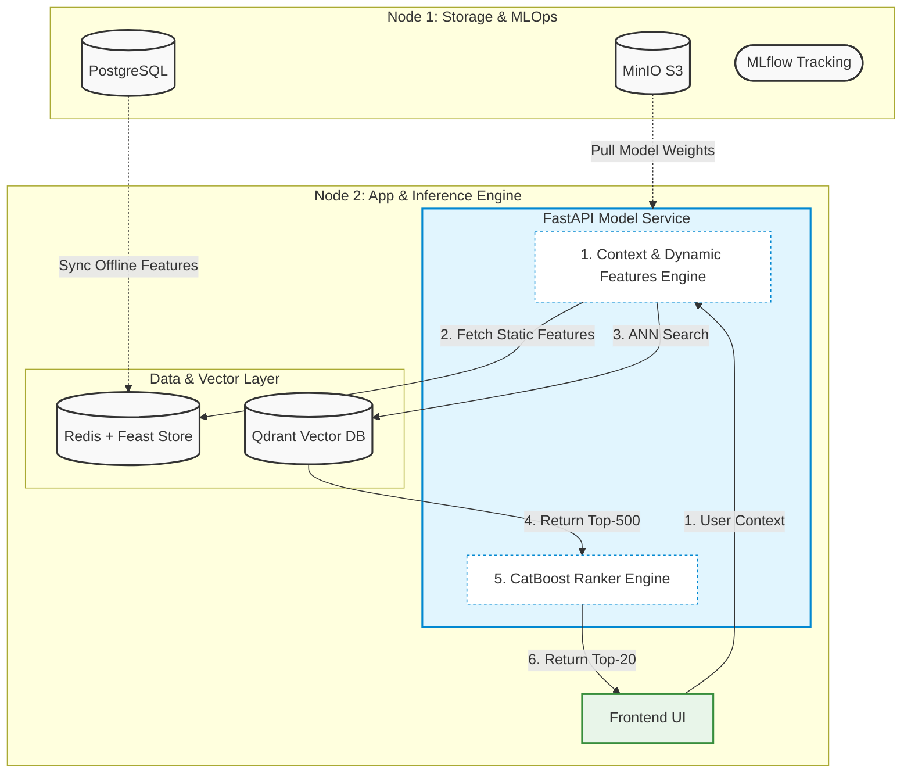

# Multi-Modal Two-Stage E-Commerce Recommendation System

A production-grade, two-stage recommendation pipeline deploying Deep Learning (DSSM Transformer) for candidate retrieval and Gradient Boosting (CatBoost) for final ranking. Built with a microservices architecture distributed across a dual-node environment using Docker, Qdrant, Feast, Redis, and MLflow.

---

## 📊 Evaluation Metrics

* **Stage 1 (Retrieval):** MAP@500 = `48.0%`
* **Stage 2 (Ranking):** NDCG@20 = `80.0%` *(Evaluated standalone on retrieved candidates)*
* **End-to-End Pipeline:** NDCG@20 ≈ `38.0%` *(True metric factoring in retrieval stage filtering)*

---

## 🏗 System Architecture

The infrastructure is distributed across two separate machines to isolate data storage/MLOps workloads from real-time low-latency inference services.



### 1. Candidate Retrieval Stage (Two-Tower DSSM)
* **Late Fusion Multi-Modal Embeddings:** Items are represented using four distinct modalities: Categorical features, Visual features (CLIP Image Embeddings), Textual features (CLIP Text Embeddings on titles), and Collaborative filtering features (Implicit ALS Embeddings).
* **Dimensionality Projection:** Before entering the towers, shared linear layers project all four high-dimensional item modalities into a unified, low-dimensional vector space where they are summed.
* **User Tower:** A **Transformer Encoder** architecture that processes the sequential history of a user's interacted item embeddings to output a real-time user vector.
* **Item Tower:** A Multi-Layer Perceptron (MLP) that refines the combined item vector. Item embeddings are pre-computed offline and indexed inside **Qdrant Vector DB** for fast cosine-similarity Approximate Nearest Neighbor (ANN) search, returning the **Top-500 candidates**.

### 2. Final Ranking Stage (CatBoost Ranker)
* **Feature Enrichment:** The 500 retrieved item candidates are enriched with static user/item features pulled instantly from the **Feast Feature Store** (backed by **Redis** as the online storage).
* **Real-Time Dynamic Inference:** To eliminate network overhead, dynamic contextual features are calculated on-the-fly using native Python during inference.
* **Final Sorting:** **CatBoost Ranker** scores the enriched candidate pool, outputting the final optimized **Top-20 recommendations** to the frontend.

---

## 🛠 Tech Stack

* **Deep Learning & ML:** PyTorch, Hugging Face (CLIP), Implicit (ALS), CatBoost
* **Vector DB & Search:** Qdrant
* **Feature Store:** Feast, Redis
* **Data & MLOps:** PostgreSQL, MinIO, MLflow
* **Infrastructure:** Docker, Docker Compose, FastAPI

---

## 📂 Repository Structure

```text
├── data/                  # Local data directory
│   ├── raw/               # Raw data
│   ├── interim/           # Datasets saved in csv and item images
│   └── processed/         # Emebeddings and fully processed data
├── Docker/                # Custom Dockerfiles and container configurations
│   ├── frontend/          # Frontend Dockerfile
│   ├── mlflow_image/      # Mlflow Dockerfile
│   └── model_service/     # Model service and backend Dockerfile
├── feature_repo/          # Feast Feature Store repository
│   ├── feature_definition.py # Entities, sources, and feature views definitions
│   └── feature_store.yaml # Feast configuration (Redis online, postgresql offline store)
├── models/                # Local model checkpoints and artifacts
├── src/                   # Production source code
│   ├── backend/           # Model inference and backend
│   ├── data/              # Data preprocessing
│   ├── db/                # Postgresql fill
│   ├── features/          # Feature and embeddings
│   ├── frontend/          # Frontend
│   └── model/             # Model training
├── .dvcignore             # DVC ignore rules
├── docker-compose.yml     # Infrastructure orchestration for Node 1 (Storage & MLOps)
├── docker-compose_backend.yaml # Production services for Node 2 (Inference Engine)
├── dvc.yaml               # DVC pipelines definitions
└── LICENSE                # Project license
```

---
